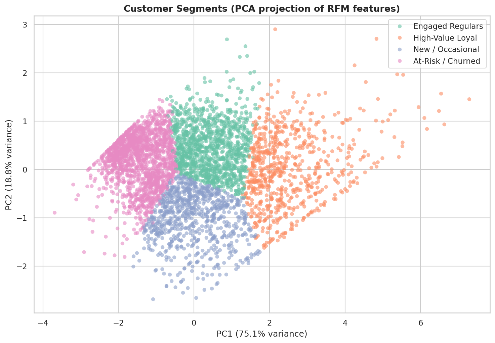
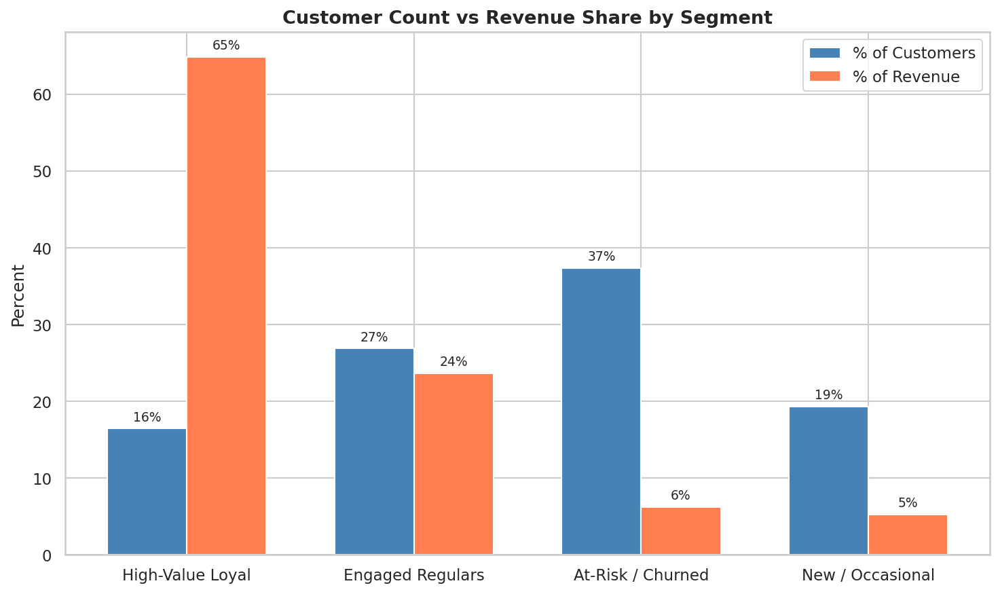

# E-Commerce Customer Analytics

End-to-end analysis of a UK online retailer's transaction data, ending with an RFM-based customer segmentation using K-Means.

[](https://colab.research.google.com/github/KelsonLam/ecommerce-customer-analytics/blob/main/ecommerce_analysis.ipynb)

The notebook is committed with all cells executed, so the charts and tables render inline on GitHub. To re-run it in Colab, add the dataset to a `data/` folder first (the file is around 45 MB, too large to ship in the repo, see the Data section below).

## Preview

Customers segmented on their Recency, Frequency, and Monetary values, shown in PCA space, alongside how much revenue each segment drives.

| Segments (PCA view) | Revenue by segment |
|--------------------|--------------------|
|  |  |

## What's in here

- **`ecommerce_analysis.ipynb`** - the full notebook (cleaning, EDA, geospatial, RFM clustering)
- **`figures/`** - rendered charts saved during the run
- **`data/`** - place the source CSV here (see Data section)

## Highlights

- Cleaned ~530K transaction rows (dropped cancelled invoices, missing IDs, negative quantities, duplicates)
- Time-of-day / day-of-week heatmap to identify peak sales windows
- KDE comparison of weekday vs weekend order values, monthly revenue trend, country-level boxplot
- Geospatial choropleth of invoice volume by country using GeoPandas
- **RFM segmentation with K-Means clustering** to group customers into actionable buckets (High-Value Loyal, Engaged Regulars, New / Occasional, At-Risk / Churned), with PCA visualization and revenue contribution per segment

## Tools

Python 3.11, pandas, NumPy, matplotlib, seaborn, GeoPandas, scikit-learn.

## Data

The notebook expects `data/EcommerceData.csv` at the repo root. This is the UCI Online Retail dataset:
https://archive.ics.uci.edu/ml/datasets/Online+Retail

The file is around 45 MB so it is excluded from version control via `.gitignore`. Drop it in `data/` after cloning.

## Running it

```bash
pip install -r requirements.txt
jupyter notebook ecommerce_analysis.ipynb
```

Run cells top to bottom. Figures save to `figures/`.

## Next steps

If I extended this I would build a churn prediction model on top of the RFM features, add product-category recommendations per segment, and run a customer lifetime value analysis on the cohorts.
